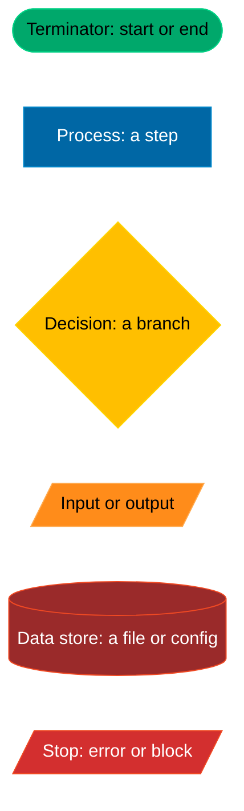
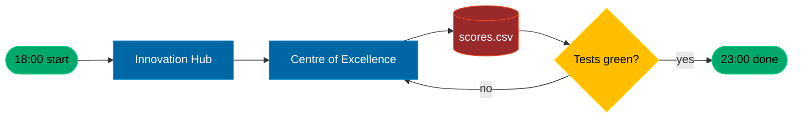

# Mermaid diagrams

Docs: https://mermaid.js.org/intro/ . Obsidian, Zed and GitHub render ```mermaid blocks with no plugin. Stay on the portable subset so all three agree.

Pick the type:
- process or flow: `flowchart LR` or `flowchart TD` (never the older `graph`)
- who calls whom over time: `sequenceDiagram`
- the states of one thing: `stateDiagram-v2`
- tables and keys: `erDiagram`; code structure: `classDiagram`
- avoid `mindmap`, `timeline` and the `@{ }` shape shorthand; older renderers break on them

Rules:
- Quote every label that has a space or punctuation: `a["18:00 Innovation Hub"]`. Escape `<` and `>` as `&lt;` and `&gt;`, use `<br/>` for a line break, never `|` inside a label.
- Under 25 nodes per diagram; split otherwise. Short node ids, words in the label.
- ISO 5807 shapes with the palette classes: terminator `([ ])` is `term` green `#00A86B`, process `[ ]` is `proc` blue `#0067A5`, decision `{ }` is `dec` yellow `#FFBF00`, input or output `[/ /]` is `io` orange `#FF8C1A`, data store `[( )]` is `store` dim red `#9A2A2A`, stop or error `[/ /]` is `stop` red `#D32F2F`.
- Never put an inline `:::class` on a line that also has a link (`-->`). Declare each node with its class on its own line; links go on separate lines.
- Paste the classDef block below verbatim into every diagram, and add the legend once per document that has diagrams.
- Put the diagram in the note where the reader needs it. `vault/Camp/Map.md` is generated by `uv run vibe map`; do not hand-edit it.

Legend and classDefs (paste, then reuse the class names):



Example, one evening as a process:


