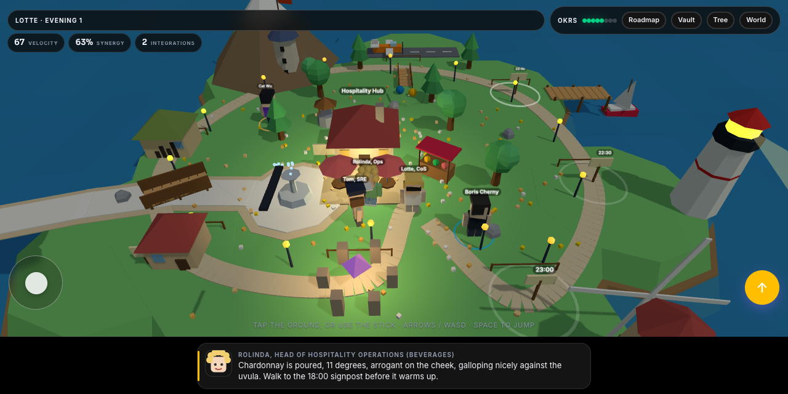
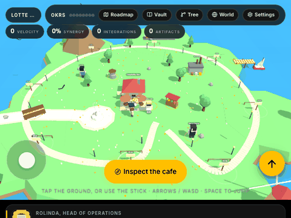

# Vibe Code Camp

From intern to expert in one evening, with wine. A 3D island you walk across, eight workstreams that each leave something real on your machine, a terminal companion that checks your work and awards XP, and an Obsidian vault that grows as you go. Internal codename: Project Grimoire.



## Play now, nothing to install

Download or clone, then double-click `game/grimoire.html`. One file, three.js embedded, no CDN, works offline on a Mac, a phone or a locked-down laptop. It is also served at https://tpetedb.github.io/vibe-map/ once GitHub Pages is switched on.



## The whole thing, in three commands

```bash
brew install just
just setup     # Homebrew tools, uv and the Python env, Playwright browsers, skills, the vault
just start     # the onboarding screen: who you are, what the machine has, where to go
```

`just start` asks for your name, your field, a difficulty from beginner to god, your model provider (Claude Code, Codex, Gemini, Copilot or OpenCode) and a theme, checks the toolbelt with one-key installs (or a YOLO button that installs everything), and launches the game, Claude Code, Claude in YOLO mode, Zed with Claude over ACP, the vault in Obsidian or the tests.

## What one evening leaves behind

| Time  | Workstream            | You end up with                                      | The check |
|-------|-----------------------|------------------------------------------------------|-----------|
| 18:00 | Innovation Hub        | a playable single-file game                          | `game/index.html` is no longer the placeholder |
| 19:00 | Centre of Excellence  | AGENTS.md rules and a first skill                    | eight lines of rules, one valid SKILL.md |
| 20:00 | Data Warehouse        | scores.csv, DuckDB queries, a Python chart           | rows in the CSV, a query, a script |
| 21:00 | Business Continuity   | git history, a rollback, one hook                    | three commits and a hooks block |
| 21:30 | Stakeholder Bridge    | one MCP integration                                  | a server in `.mcp.json` |
| 22:00 | Knowledge Tree        | a linked vault and its graph                         | six notes, twelve links, no dead ones |
| 22:30 | Go-to-Market          | the game at a public URL                             | a Pages workflow or a live Pages site |
| 23:00 | Autonomous Operations | headless Claude on a schedule, a subagent            | a subagent file and a schedule |

`uv run grimoire check 3` runs the checks for a workstream and awards the XP when they pass. Levels mirror the ages of the tech tree: Intern, Junior, Medior, Senior, Expert. Four evenings, four islands, thirty-two stops, twelve mentors from the field who stand on the islands with their real ideas and sources.

## Make it yours

- **Persona.** `uv run grimoire persona data-engineer` tunes the example game, the dataset, Rolinda's questions and the recipes to your field. Six presets: chief of staff, cleaning-company CEO, university managing director, pabo teacher, data engineer, interior stylist.
- **Difficulty.** `uv run grimoire difficulty hard`: beginner and easy spell every command out, hard and expert add strict and extra checks, god needs `just verify` green to claim.
- **Theme.** `uv run grimoire theme boardroom` swaps the wine-night jargon for a serious voice; `--create` asks your provider to write a new one into `themes/`.
- **Provider.** Everything that talks to a model (`explain`, `council`, custom themes) uses the CLI you chose, in print mode.
- **Note-taking.** `uv run grimoire vault method zettelkasten` bootstraps a method into the vault: Zettelkasten, PARA, Johnny.Decimal, LYT, Evergreen, Cornell, Bullet Journal, or daily notes with a weekly review.

Every knob lives in `grimoire.toml`; delete the file and everything still works.

## Break things on purpose

```bash
just break dragons          # a play/dragons branch, a sandbox
uv run grimoire explain     # your provider explains the last commits in plain words
just rescue                 # back on main, nothing lost
uv run grimoire council "Should I learn git before Python?"   # four mentors answer, review each other, a chairman decides
```

## What is in the box

| Path | What |
|---|---|
| `game/grimoire.html` | The game, built from `src/` by `just build`. |
| `grimoire/` | The terminal companion: quests and XP, personas, themes, toolbelt, providers, council, the vault builder, the onboarding screen. |
| `vault/` | An Obsidian vault, pre-configured and lint-clean, 100 notes on day one. |
| `.agents/skills/` | Fourteen skills in the Agent Skills standard, linked into `.claude/skills/` by `just setup`. |
| `docs/` | [Syllabus](docs/SYLLABUS.md), [Roadmap](docs/ROADMAP.md) (the tech tree, every date sourced), [Cookbook](docs/COOKBOOK.md), [Design](docs/DESIGN.md), [Ecosystem](docs/ECOSYSTEM.md), [Vault](docs/VAULT.md), [Note methods](docs/NOTE-METHODS.md), [Skills](docs/SKILLS.md), [Age of Epochs study](docs/AOE-STUDY.md), [ADRs](docs/adr/README.md). |
| `tests/` | Pytest: CLI, build, Chromium and WebKit iPhone smoke tests, the onboarding screen, and a full play-through of every path. |
| `justfile` | Every task, for people and for agents. `just` lists them. |

## Use it as a template

Press **Use this template** on GitHub, clone, `just setup`, `just start`. The repo practises what it teaches: [CHANGELOG.md](CHANGELOG.md) in Keep a Changelog form, decisions in `docs/adr/`, versions in `pyproject.toml`, CI and Pages as GitHub Actions in `.github/workflows/`, secrets in a gitignored `.env` next to `env.example`.

## For agents

Read [HANDOVER.md](HANDOVER.md), then [AGENTS.md](AGENTS.md). `just verify` is the gate before a commit.

## Credits and licences

MIT. three.js (MIT) and [Motion](https://motion.dev) (MIT) are embedded in the game. Two vendored skills keep their licences next to them (Anthropic's webapp-testing, Apache-2.0; obra's verification-before-completion, MIT). The idea for the tech tree is Age of Empires; the study of a real browser AoE, sokrypton/aoe, is in the docs, ideas only.
