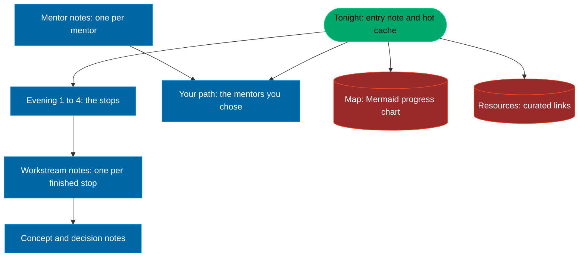

# The vault

`vault/` is an Obsidian vault: a folder of Markdown files that the vibe CLI writes and you read, link and extend. Open it in Obsidian for the graph; open it in any editor for the text. Nothing in it needs a community plugin.

## Layout

| Path | What lives there |
|---|---|
| `vault/Camp/` | every note, flat, one file per topic |
| `vault/Camp/_templates/` | Obsidian templates for the four note kinds, hidden from the graph |
| `vault/.obsidian/` | Obsidian settings, committed so the vault looks the same on every machine; `workspace.json` is ignored |

## The notes

- **Tonight.md** is the entry note and the hot cache. It links every workstream, the four evenings, the map, your path and the resources, and its *Build log* takes one dated line per session, newest first. Start here, every time.
- **Evening 1 to 4**: the stops of each evening with their official docs.
- **Map.md**: a Mermaid flowchart of your progress, regenerated by the CLI.
- **One note per finished workstream**, written by `vibe done`.
- **One note per mentor** you chose in the game, plus **Your path.md** listing all twelve.
- **Resources.md**: the curated links, a copy of `docs/RESOURCES.md`.
- Study, concept and decision notes, written by you or an agent.

## Conventions

Every note has a `# Title` equal to its file name, `[[wikilinks]]` to at least two other notes, dated `## YYYY-MM-DD` sections newest first, a `## Sources` list of real URLs, and its tags on the last line. The CLI rewrite adds YAML frontmatter to every note:

```yaml
---
title: Age of Epochs study
date: 2026-09-16
tags: [decision, concept]
---
```

The tags double as the graph legend. The first matching group colours a node, so a note tagged `#decision #concept` is red.

Every generated tech note also carries the tag of its shelf, and each shelf has a colour of its own in the graph: `#shell` blue, `#git` orange, `#formats` yellow, `#code` green, `#data` bright green, `#net` bright blue, `#ship` bright red, `#agents` red, `#docs` dim yellow, `#knowledge` bright orange, `#future` grey. The shelf groups sit before the generic `#tech` group, so the graph shows eleven shelves instead of one yellow cloud; the note itself says the shelf and the depth (basics, working knowledge, deep).

| Tag | Colour | Meaning |
|---|---|---|
| `#workstream` | green `#00A86B` | something shipped |
| `#people` | blue `#0067A5` | a mentor |
| `#tech` | yellow `#FFBF00` | a tool or a technique |
| `#decision` | red `#D32F2F` | a choice with consequences |
| `#concept` | orange `#FF8C1A` | an idea |
| `#overview` | grey `#CCCCCC` | navigation: Tonight, Map, Evenings, Resources |

## How the notes link



Legend: stadium, the start; rectangle, a kind of note you write; cylinder, a view the CLI generates.

## Open it

In Obsidian, click the **Vault profile** icon at the bottom left, choose **Manage vaults...**, click **Open** next to *Open folder as vault* and pick `vault/`. The committed `.obsidian/` folder brings the dark base, the `vibe` CSS snippet (if it shows as off under Settings, Appearance, CSS snippets, click reload and toggle it on), the graph colour groups, and the Templates core plugin pointed at `Camp/_templates`. In a new note, run **Templates: Insert template** from the command palette and pick Workstream, Concept, Person or Decision; `{{title}}`, `{{date}}` and `{{time}}` fill themselves in.

## The CLI and the claude-obsidian plugin

The claude-obsidian plugin follows Karpathy's LLM Wiki pattern: an index page, a hot cache, an operation log, a deterministic lint, and `wiki/` folders per page type. This vault keeps the ideas and drops the machinery:

| In the plugin | Here |
|---|---|
| `wiki/index.md` and `wiki/hot.md` | `Tonight.md`, one note doing both jobs |
| `wiki/log.md` | the *Build log* in Tonight, and the dated sections in each note |
| `wiki/overview.md` | `Map.md` |
| `wiki-ingest`, `save`, transaction bundles | `vibe done`, `vibe vault build`, or an agent using the `obsidian-notes` skill |
| `wiki-lint` | `vibe vault lint` |

What to run:

- `just vault`, or `uv run vibe vault build` then `uv run vibe vault lint`, after every session.
- `/claude-obsidian:obsidian-markdown` for syntax help with callouts, embeds and properties; `/claude-obsidian:think` for a review loop.
- Do not run `/claude-obsidian:wiki` (init or adopt) against `vault/`. It would scaffold `wiki/`, `.raw/` and ledgers next to `Vibe Code Camp/`, and its lint only reads `wiki/`. The CLI owns this vault's structure.

## Lint checklist

`vibe vault lint` reports the first two; check the rest by eye.

1. Dead links: every `[[target]]` resolves. Unmet mentors and unfinished workstreams are expected dead links from `Tonight` and `Your path`; the graph hides them (`hideUnresolved`).
2. Orphans: every note is reachable from `Tonight`. Orphans stay visible in the graph so you notice them.
3. Frontmatter: `title`, `date` and `tags` present, and `title` equals the `# Title`.
4. Dates: `## YYYY-MM-DD` sections, newest first.
5. Sources: real URLs only, one per line.
6. Tags: from the legend above, on the last line.
7. Map: `Map.md` renders after `vibe map`.
