# Media

Every image in this folder, what it shows, what renders it and where it is used. A picture nobody links to is either a job for a document or a job for the bin; this table is how that stays true.

Regenerate with `just media` (the game, through Playwright, from the built file), `uv run python tools/campus_shots.py` (the campus before anyone has played) and `just tui-media` (the terminal screens and the pets, from real terminal output). All three write here. Never hand-edit an image in place; render it again. One test writes here too, which it should not: `tests/test_game_pet.py` rewrites the six `pets-game/` crops while [issue 148](https://github.com/tpetedb/vibe-map/issues/148) is open, and `just media` is what puts them back. Every other test writes to `tests/out/`.

| File | Shows | Rendered by | Used in |
|---|---|---|---|
| `hero.png` | The title card whole over the island, in a 1200x630 window, the Open Graph size | `just media` | The social preview of the repository and the hosted site |
| `onboarding-start.png` | The title screen on a first visit | `just media` | `README.md` |
| `island-campus.png` | Evening 1, the Innovation Campus at dusk | `just media` | `README.md` |
| `island-winter.png` | Evening 2, the Cold Storage Cluster | `just media` | `docs/ABOUT.md` |
| `island-desert.png` | Evening 3, the Sandbox Environment | `just media` | `docs/ABOUT.md` |
| `island-prod.png` | Evening 4, the Production Environment | `just media` | `docs/ABOUT.md` |
| `island-winter-artifacts.png` | The winter island whole, with the data centre, the library and the energy grid in frame | `just media` | `README.md` |
| `archipelago.png` | The farthest zoom: the island in the archipelago, the other three as silhouettes, the bridges between them | `just media` | this page |
| `roadmap.png` | The Roadmap panel, with the Continue card at the top | `just media` | `docs/ABOUT.md` |
| `vault.png` | The vault graph | `just media` | `docs/ABOUT.md` |
| `tree.png` | The tech tree | `just media` | `docs/ABOUT.md` |
| `phone.png` | The HUD at 393 points wide | `just media` | `docs/ABOUT.md` |
| `phone-more.png` | The More menu on a phone: one opaque sheet on the bottom edge of the window, all seven rows on screen | `just media` | this page |
| `backpack.png` | The Backpack: the inventory, the achievements and the wardrobe | `just media` | this page |
| `ask.png` | The Ask panel, with the stop it is about | `just media` | this page |
| `dashboard.png` | The Stats panel: the tiles, the ring per island, XP over time | `just media` | this page |
| `settings.png` | The Settings rows, grouped under their five headings | `just media` | this page |
| `bottle.png` | A message in a bottle where it lies, on the shore | `just media` | this page |
| `artifact-cafe.png` | The cafe sheet: order five in one second, get a 429 | `just media` | `README.md` |
| `gameplay.gif` | Walking across the campus bridge to winter, opening its first workstream and claiming it | `just media` | `README.md` |
| `island-campus-start.png` | The campus as a first visit finds it | `tools/campus_shots.py` | `CHANGELOG.md` |
| `pets-game/*` | The six pixel species as the browser game draws them, beside the walker | `just media` | this page |
| `tui-pet.png`, `tui-pet.gif` | The pet strolling under the launch screen | `just tui-media` | `README.md` |
| `pets.png`, `pets/*` | The six pixel species in the terminal, still and animated | `uv run python tools/tui_media.py --pets` | `README.md`, `docs/ABOUT.md` |
| `tui-welcome.png` | `just start`, the Welcome screen on a first run | `just tui-media` | `README.md` |
| `tui-map.png` | `just start`, the campaign map part way through evening 1, with the four marks and their legend | `just tui-media` | `README.md` |

## The panels, so the table above is not the only place they live

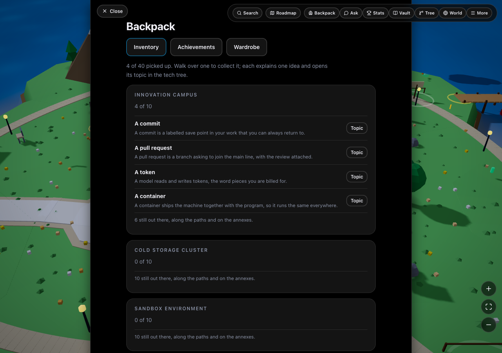

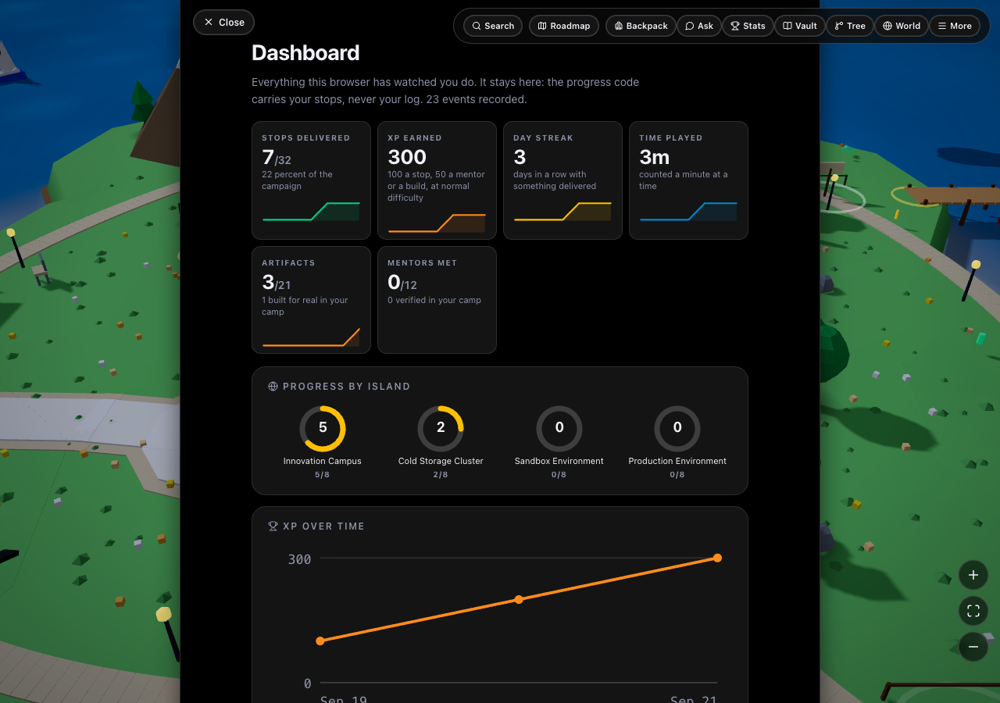

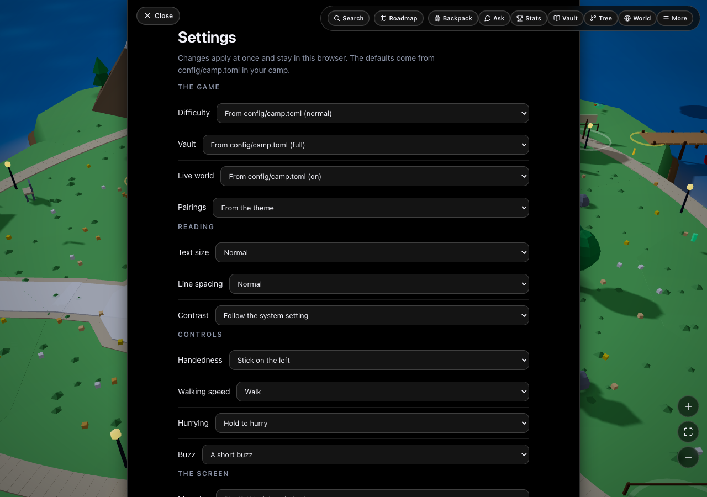

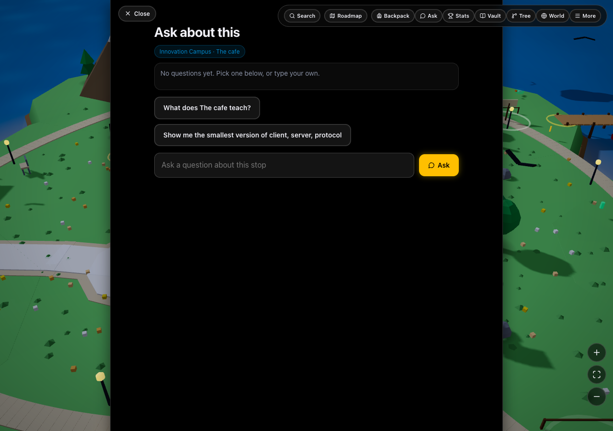

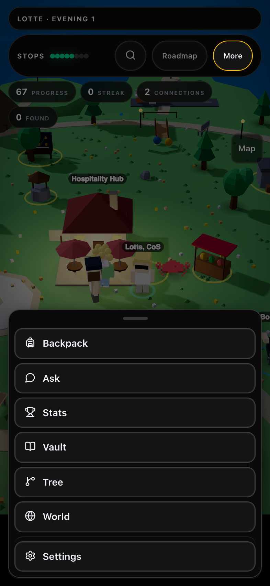

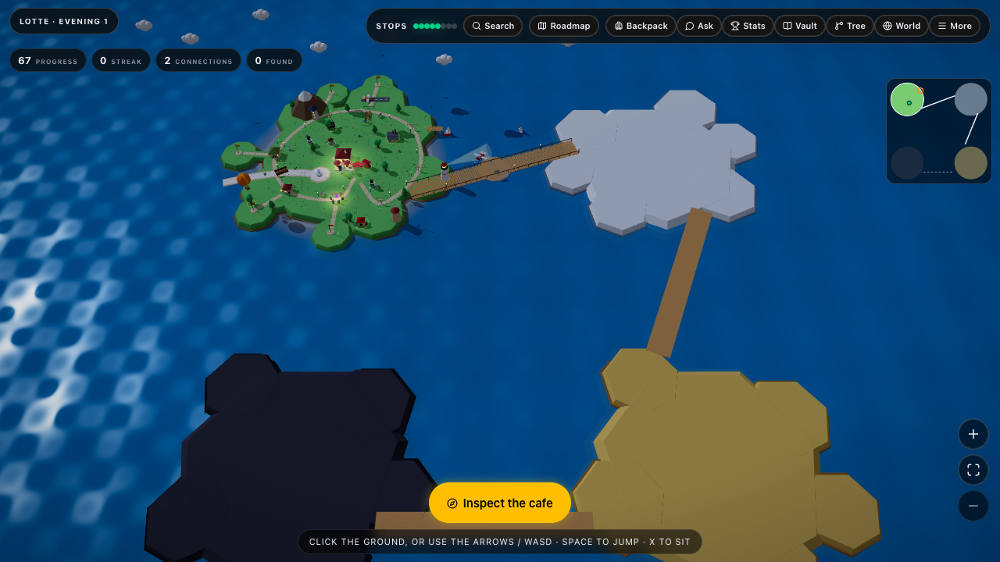

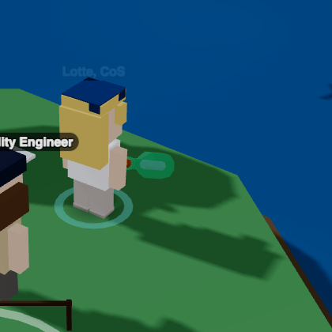

The six species as the browser game draws them, beside the walker:

| | | |
|---|---|---|
| 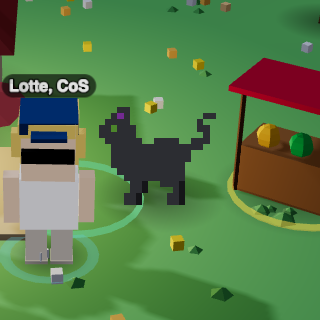 | 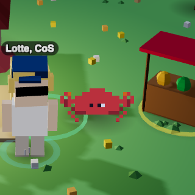 | 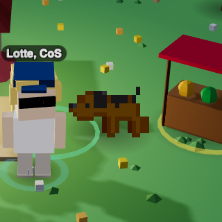 |
| 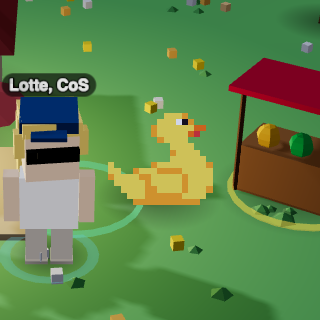 | 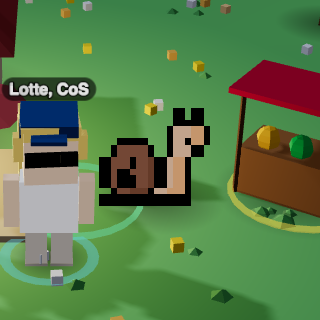 | 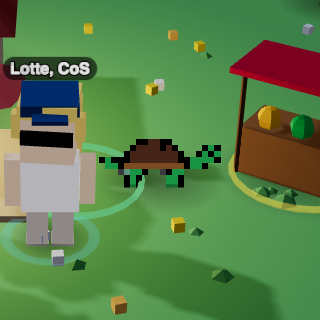 |
