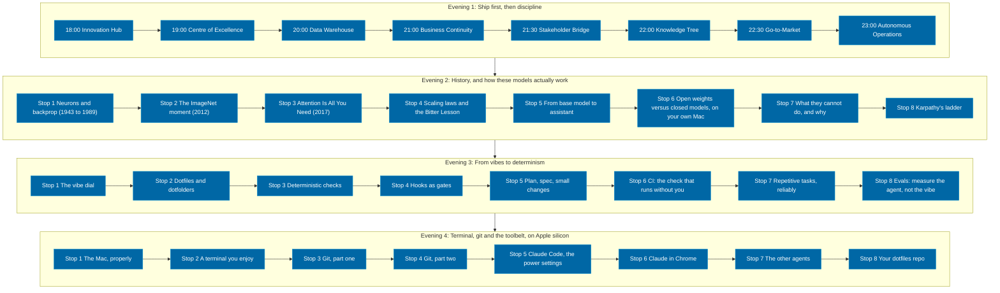
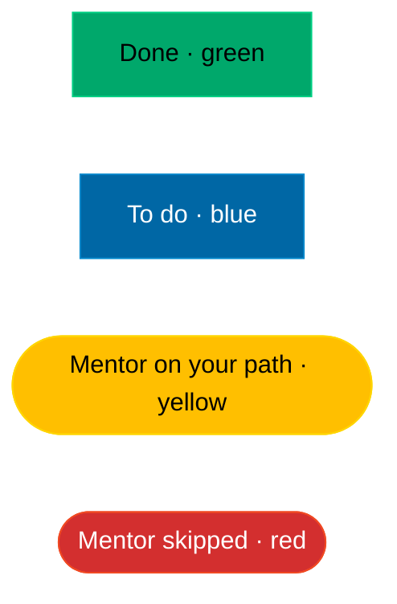

# Map

0/32 stops across four evenings. Updated 2026-09-16.

```mermaid
flowchart TD
  subgraph E0["Evening 1: Ship first, then discipline"]
    c0["18:00 Innovation Hub"]
    c1["19:00 Centre of Excellence"]
    c2["20:00 Data Warehouse"]
    c3["21:00 Business Continuity"]
    c4["21:30 Stakeholder Bridge"]
    c5["22:00 Knowledge Tree"]
    c6["22:30 Go-to-Market"]
    c7["23:00 Autonomous Operations"]
    c0 --> c1 --> c2 --> c3 --> c4 --> c5 --> c6 --> c7
  end
  subgraph E1["Evening 2: History, and how these models actually work"]
    w0["Stop 1 Neurons and backprop (1943 to 1989)"]
    w1["Stop 2 The ImageNet moment (2012)"]
    w2["Stop 3 Attention Is All You Need (2017)"]
    w3["Stop 4 Scaling laws and the Bitter Lesson"]
    w4["Stop 5 From base model to assistant"]
    w5["Stop 6 Open weights versus closed models, on your own Mac"]
    w6["Stop 7 What they cannot do, and why"]
    w7["Stop 8 Karpathy's ladder"]
    w0 --> w1 --> w2 --> w3 --> w4 --> w5 --> w6 --> w7
  end
  subgraph E2["Evening 3: From vibes to determinism"]
    d0["Stop 1 The vibe dial"]
    d1["Stop 2 Dotfiles and dotfolders"]
    d2["Stop 3 Deterministic checks"]
    d3["Stop 4 Hooks as gates"]
    d4["Stop 5 Plan, spec, small changes"]
    d5["Stop 6 CI: the check that runs without you"]
    d6["Stop 7 Repetitive tasks, reliably"]
    d7["Stop 8 Evals: measure the agent, not the vibe"]
    d0 --> d1 --> d2 --> d3 --> d4 --> d5 --> d6 --> d7
  end
  subgraph E3["Evening 4: Terminal, git and the toolbelt, on Apple silicon"]
    p0["Stop 1 The Mac, properly"]
    p1["Stop 2 A terminal you enjoy"]
    p2["Stop 3 Git, part one"]
    p3["Stop 4 Git, part two"]
    p4["Stop 5 Claude Code, the power settings"]
    p5["Stop 6 Claude in Chrome"]
    p6["Stop 7 The other agents"]
    p7["Stop 8 Your dotfiles repo"]
    p0 --> p1 --> p2 --> p3 --> p4 --> p5 --> p6 --> p7
  end
  E0 --> E1
  E1 --> E2
  E2 --> E3
  class c0,c1,c2,c3,c4,c5,c6,c7 todo
  class w0,w1,w2,w3,w4,w5,w6,w7 todo
  class d0,d1,d2,d3,d4,d5,d6,d7 todo
  class p0,p1,p2,p3,p4,p5,p6,p7 todo
  classDef done fill:#00A86B,stroke:#00D084,color:#000000
  classDef todo fill:#0067A5,stroke:#0088CC,color:#FFFFFF
  classDef deep fill:#FFBF00,stroke:#FFD500,color:#000000
  classDef skip fill:#D32F2F,stroke:#F04923,color:#FFFFFF
```

### Legend

```mermaid
flowchart LR
  a["Done · green"]:::done
  b["To do · blue"]:::todo
  c(["Mentor on your path · yellow"]):::deep
  d(["Mentor skipped · red"]):::skip
  classDef done fill:#00A86B,stroke:#00D084,color:#000000
  classDef todo fill:#0067A5,stroke:#0088CC,color:#FFFFFF
  classDef deep fill:#FFBF00,stroke:#FFD500,color:#000000
  classDef skip fill:#D32F2F,stroke:#F04923,color:#FFFFFF
```

Back to [[Tonight]] · [[Your path]]

#overview
