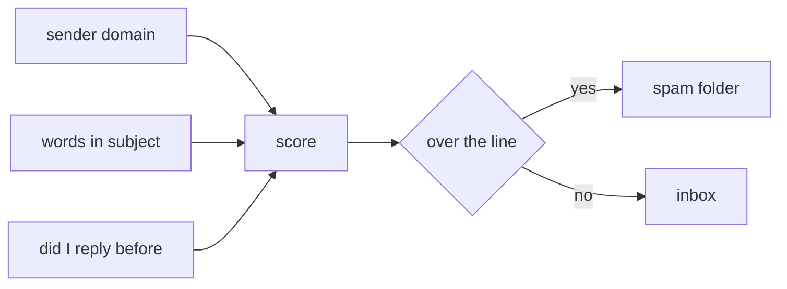

# Why my mail client thinks a message is spam

## What I looked at
I moved three messages to spam and three out of it, then watched which ones it
guessed right the next day. The sender domain seems to weigh more than the
words.

