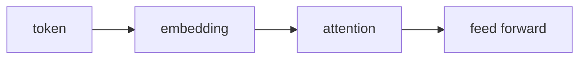

# The transformer block
Tokens go in, attention mixes them, the block repeats.

Attention is the part that looks at every other token in the window.
A token is a chunk of text, not a word, which is why counting letters fails.
